**Welcome to PixiEditor!**

If you haven't yet, you can <a href="https://pixieditor.net/download/">download PixiEditor here</a>.

On this page, you'll find all the information about the app's UI.

## The Startup Window

Once you open the app, an extra window will open up called ```Hello there!```. That is the startup window. You can also open it manually by going to ```View → Open startup window``` in the menu bar.

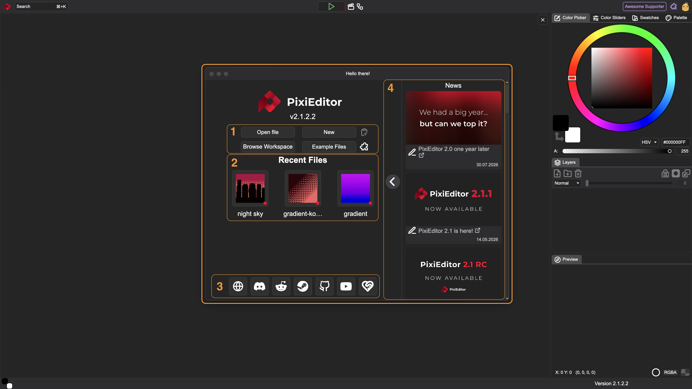

In the screenshot, there are 4 main parts of that window highlighted in orange:

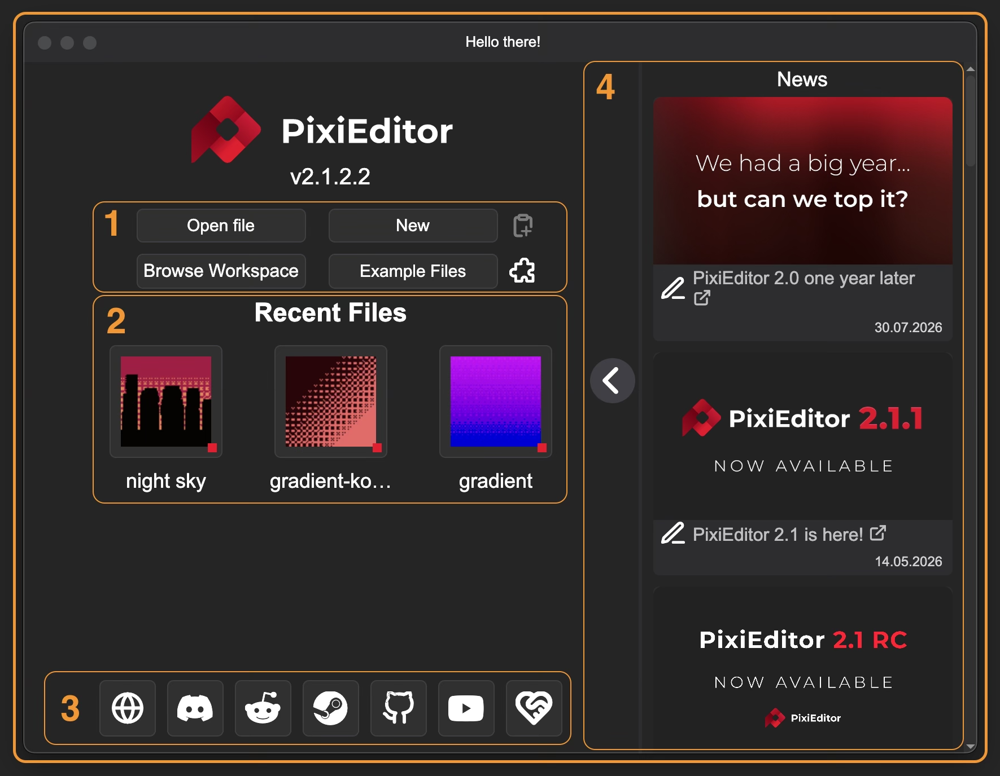

###  1. Button Group
- ```Open File``` Opens file explorer. It lets you choose pixi files, but also all other file types supported by PixiEditor such as jpg, png, svg, etc.
- ```New``` Opens the [Create New Image](#create-new-image) Window.
- ```Browse Workspaces``` Opens the Workspaces Browser. *Visible only with Workspaces extension installed, which is available in the Extension Library*
- ```Explore Files``` Opens the Example Files made by PixiEditor Team and Contributors.
-  <span className="pixi-icon icon-paste-as-new-layer"/> - Creates new file from clipboard 
-  <span className="pixi-icon icon-extensions"/> - Opens extensions library 

### 2. Recent Files
Under Recent Files, you can see your most recent files opened. To see it as a list with a full path, go to ```File → Recent``` in the menu bar.

### 3. Social Icons
At the bottom of the page, you'll find key PixiEditor links. Hover over any link to preview its destination.

### 4. News Feed
A panel with PixiEditor-related news. It can be hidden by clicking a button with an arrow or permanently disabled in the settings.


## Create New Image

There are 3 main ways to create a new empty file:

1. Click the ```New``` button in the startup window
2. Use a shortcut ```Ctrl + N``` on Windows or ```⌘ + N``` on Mac
3. Use ```File → New``` in the menu bar

Each of the above will open the Create New Image Window:

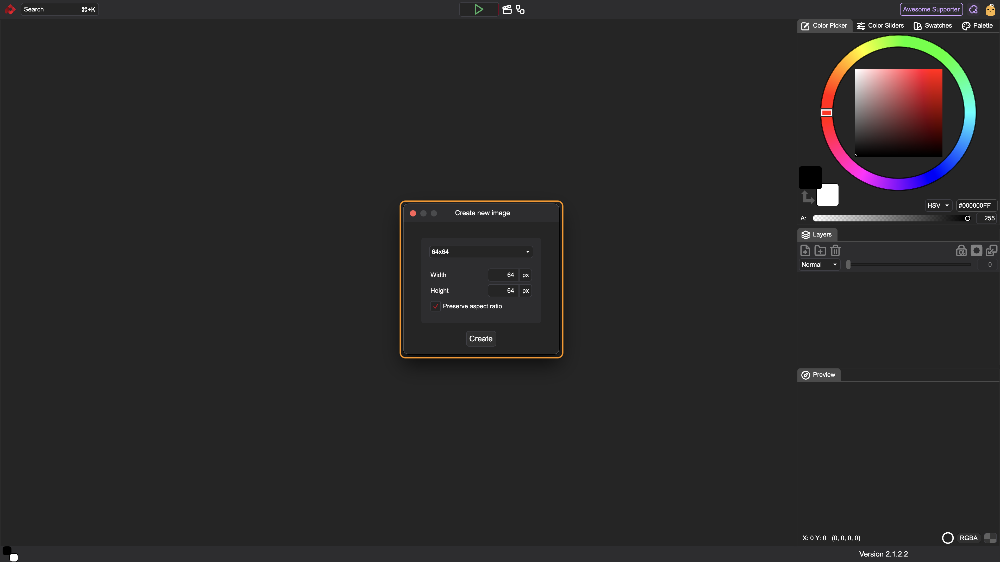

From top to bottom, the options in this window are:
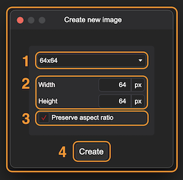


### 1. Presets Picker
A dropdown menu containing presets of the 9 most popular image dimensions. Selecting a preset prefills the width and height inputs.

### 2. Width + Height
Use these fields to set your desired dimensions. You can type values directly using your keyboard or click and drag to the sides to adjust the number.

The fields support basic math operators (+, -, *, /). For example, typing 1920/2 and clicking outside the field automatically calculates the result.

Note: *PixiEditor currently supports pixels only.*

### 3. Preserve Aspect Ratio
Checking this box locks the proportional relationship between width and height. 

Once you choose all options, click the ```Create``` button at the bottom or hit ```Enter```.


## Toolsets

Located to the left of the canvas (when a file is open), toolsets group tools by workflow:

- Pixel Art: Hard-edged tools with no anti-aliasing 
- Painting: Soft-edged tools with anti-aliasing enabled
- Vector: Scalable, path-based tools that keep shapes sharp at any resolution
- Adjustments: Tools for color, exposure, and image corrections

Toolsets are fully customizable! See the [Creating custom tools with Brush Engine](https://pixieditor.net/docs/usage/brushes/brush-tools/) page for details.

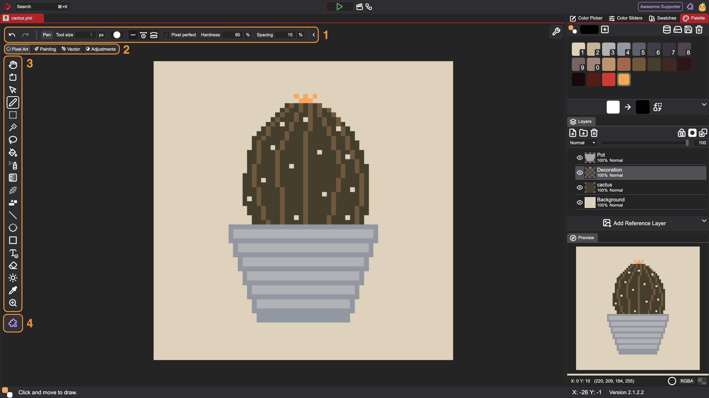

### 1. Tool Context Bar

On the left side of the context bar, there are always visible undo and redo arrows. They change the last action made in the app no matter what tool is selected. You can also use shortcuts for that: ```Ctrl + Z``` / ```⌘ + Z``` for undo, and ```⌘ + Shift + Z``` / ```Ctrl + Shift + Z``` for redo.

The second part of this bar is collapsible. You can hide it by using the arrow at the end of the bar. This part shows the tool's name and its specific settings. You can notice how it changes while selecting different tools.

### 2. Toolset Picker

To switch your active toolset, hover over the toolset pill to reveal the available options. Alternatively, you can cycle through them using keyboard shortcuts: ```Shift + E``` to move forward and ```Shift + Q``` to move backward.

### 3. Tools

Below the toolset name, there is a group of icons, each representing a different tool. To select a tool, click on its icon. The active tool is marked with a white outline.

### 4. Extension Library

Opens the Extension Library, where you can browse and download extra tools, brushes, and workspaces.

## Preview Tab

In the bottom right corner, you can see the preview tab.

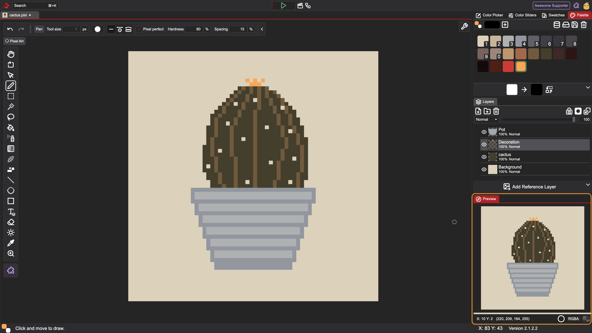

:::tip
**All tabs in PixiEditor are dockable.**

To undock a window, click and drag its red header to move it into a separate, floating window.

To dock it back into place or somewhere else in the interface, click and drag the red header and hover over your desired location. A red highlight area will appear to preview where the window will snap. Move the window around until the red preview zone appears where you want it, then release.
:::

Other than the preview itself, there are some information and toggle buttons in the bottom.

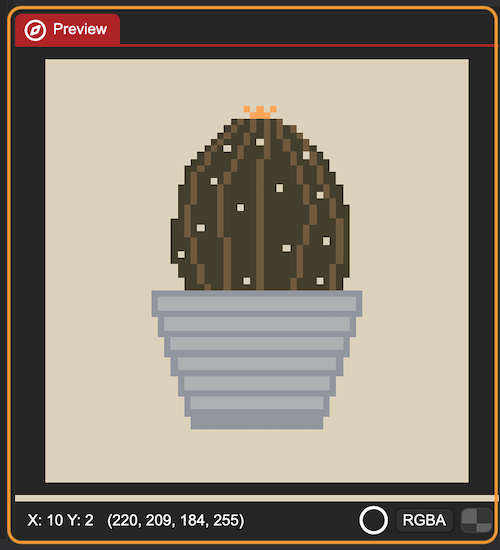

While using your pointer on the preview, you can see the pointer position (X and Y) and the color your pointer is pointing to. By default, the color is in RGBA. You can change it to HEX by using the toggle on the right with the color format name. 

The white circle lets you choose between high resolution (vectors render smoothly without pixelation) and low resolution (vectors render to the document's actual size) of preview. 

In the right corner, there is an option to change the background of the preview. By clicking the rectangle, you change to: no color, solid white, solid black, checker pattern. Of course, this feature makes sense only if you don't have a fully filled layer on your canvas.

## Layer Panel

Layers are the heart of your files. By default, the layer panel is placed in the middle of the right side of the app.


It contains a few sections highlighted below:

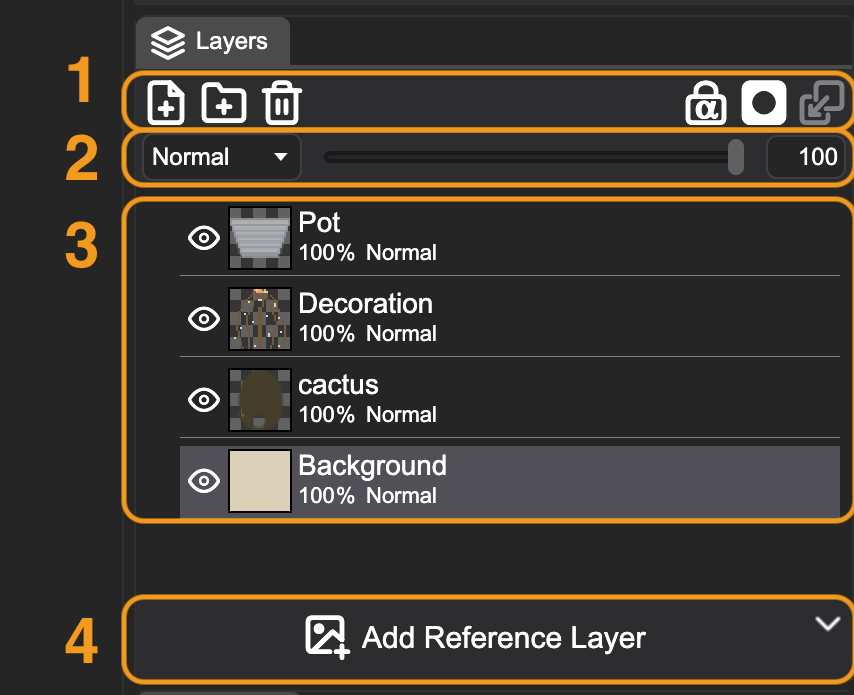

###  1. Button Group
-  <span className="pixi-icon icon-file-plus"/> - Creates new layer
-  <span className="pixi-icon icon-folder-plus"/> - Creates new folder
-  <span className="pixi-icon icon-trash"/> - Deletes all selected layers and folders (you can redo this action)
-  <span className="pixi-icon icon-alpha-lock"/> - Locks transparency of the select layer. Enabling this option will prevent tools from editing transparent pixels.
-  <span className="pixi-icon icon-create-mask"/> - [Creates a mask](https://pixieditor.net/docs/usage/layers/masking/) for the selected layer
-  <span className="pixi-icon icon-merge"/> - Combines selected layer/group with the layer/group below into a single, unified layer, flattening pixels together and reducing your total layer count.

###  2. Layer Options

For each layer, you can change the blend mode by clicking the dropdown menu (set to Normal by default). Next to it is an opacity slider, which you can use to adjust how transparent the layer is. You can either drag the slider or click its numerical input field to type in an exact opacity percentage.

###  3. Layers

Each layer has an eye icon <span className="pixi-icon icon-eye"/> / <span className="pixi-icon icon-eye-off"/> to toggle its visibility in the composition. Next to it is a thumbnail preview of the layer content, followed by its name, blend mode, and opacity settings.

To rename a layer, double-click its name to enter text-editing mode and type your new title.

###  4. Add Reference Layer

Sometimes you may want to use an external image as a visual guide while working. To add one, click the ```Add Reference Layer``` button and select a supported raster image file (such as PNG or JPG) from your computer.

Unlike standard layers used for drawing, a reference layer is strictly for visual preview and guidance. It is excluded from the actual layer tree, meaning it can't be painted on or edited directly. Because it is purely for preview, it won't interfere with your artwork and maintains high resolution even on small canvases.

Once you select an image, you'll see it on the canvas, and some new elements will appear on the UI:

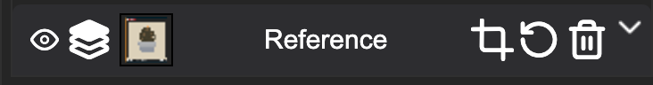

-  <span className="pixi-icon icon-eye"/> / <span className="pixi-icon icon-eye-off"/> - Hides / Shows the reference layer
-  <span className="pixi-icon icon-layers-top"/> / <span className="pixi-icon icon-layers-bottom"/> - Changes the reference layer position to above/under other layers
-  Preview of the reference layer
-  <span className="pixi-icon icon-crop"/> - Enters a transformation mode for the reference layer (scaling and moving the layer)
-  <span className="pixi-icon icon-reset"/> - Resets transformations made to the reference layer
-  <span className="pixi-icon icon-trash"/> - Deletes the current reference layer. 

## Color Tabs

This panel by default is made out of 4 tabs and lets you work with colors.

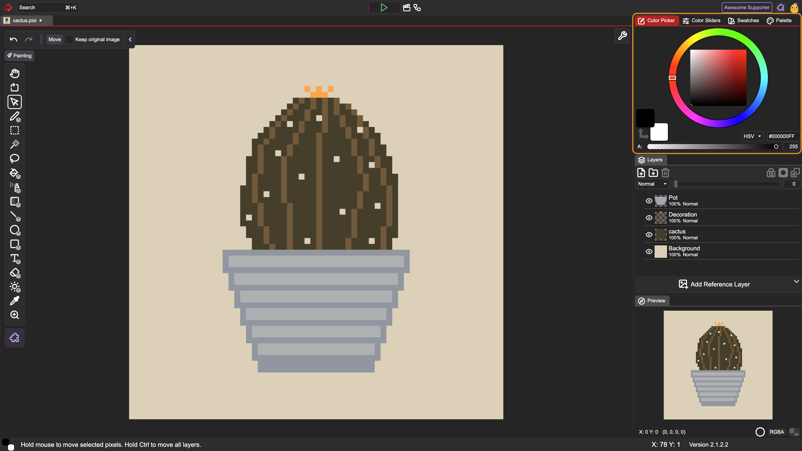

We'll describe each separately.

### Color Picker
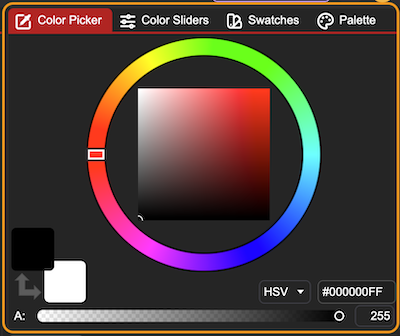

The main part of this tab is an HSV/HSL Color Picker, which consists of a circular hue slider and HV/HL square.

In the bottom-left corner, there are 2 squares with an arrow. The top square is the primary color, and the one below is the secondary color. Clicking on the arrow swaps the two colors (default keyboard shortcut: ```X```).

On the bottom, there is a wide slider which controls the alpha. You can also use an input on the right to change its value.

The last two elements are the HSV/HSL dropdown and a color value written in HEX.

The dropdown allows you to switch between HSV and HSL color space representations. Next to it, the color value is displayed in the ```#RRGGBBAA``` HEX format, where the pairs of hexadecimal characters represent Red (RR), Green (GG), Blue (BB), and Alpha/Transparency (AA).

### Color Slider
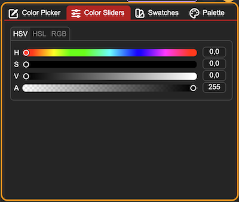

With these sliders, you are changing the primary color. It is a set of HSV/HSL/RGB + Alpha sliders. They additionally have inputs for entering precise values.

### Color Swatches
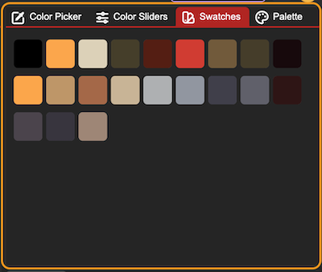

Using a canvas-editing tool (such as the pen, shapes, or bucket fill) automatically adds your active primary color to the swatches list. For example, if you apply a semi-transparent red using the bucket fill tool, that exact semi-transparent color is added to your swatches for quick re-selection.

Using non-editing tools like the color picker will not add a swatch.

### Color Palette
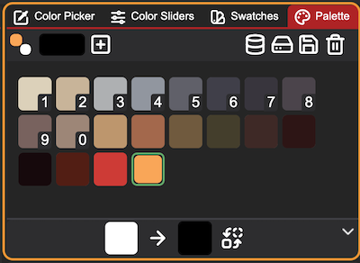

This tab lets you use and edit color palettes in PixiEditor. Color palettes are quite advanced, so all features not visible at first glance will be covered in another material.

Most actions can be found at the top bar:

- The two squares present current primary and secondary colors just like in the color picker (you can click ```X``` on the keyboard to swap them)
- The longer rectangle is for adding new colors to the color palette. It doesn't change the primary color. Clicking on it opens a small color picker.
-  <span className="pixi-icon icon-plus-square"/> - Adds selected color to the palette
-  <span className="pixi-icon icon-database"/> - Opens the Palette Browser 
-  <span className="pixi-icon icon-hard-drive"/> - Opens file manager to import a new palette from your drive. [Check this guide](https://pixieditor.net/blog/2025/03/19/q1-status/#color-palettes) for supported formats.
-  <span className="pixi-icon icon-save"/> - Saves the palette to your drive
-  <span className="pixi-icon icon-trash"/> - Deletes the current palette

In the middle, you can see all colors of a palette. The first 10 colors have small numbers - that is the shortcut for choosing a color. Just click a corresponding number on your keyboard to set it as the primary color. You can drag the color rectangles to change order.

At the bottom of the interface, you’ll find a panel dedicated to replacing palette colors. This is a global operation: changing a color here updates not only your palette, but also automatically repaints every pixel on your canvas that currently uses that color.

To replace a color:

1. Drag the color you want to change from your palette into the left rectangle.
2. Click the right rectangle to choose your new replacement color.
3. Click the swap icon <span className="pixi-icon icon-swap"/> to apply the change across your palette and canvas.

## Viewport Options 

There is one icon in the top-right corner of the viewport that hides many important options. To view these options, click on the button with <span className="pixi-icon icon-tool"/>  icon.

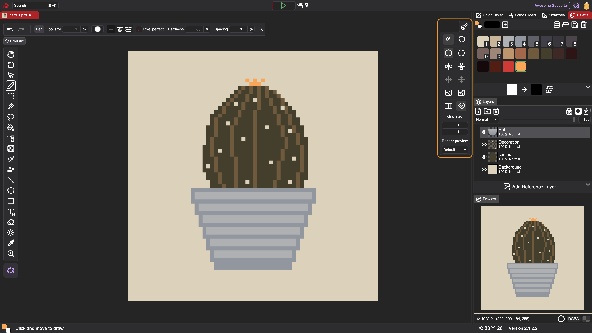
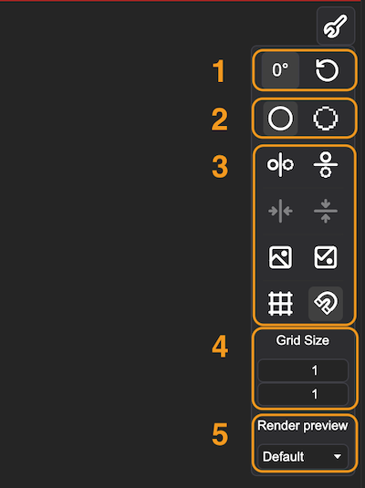

### 1. Canvas Rotation

-  Number of degrees by which the viewport is rotated. To rotate the viewport, use the rotation tool <span className="pixi-icon icon-rotate-view"/> available in each toolset.
-  <span className="pixi-icon icon-reset"/> - Resets the viewport to the default rotation, position, and scaling

### 2. Canvas Resolution

A toggle to enable/disable the viewport's high-resolution preview:

-  <span className="pixi-icon icon-circle"/> - High resolution preview. Vector shapes, such as an ellipse drawn on a small 64×64 canvas, render smoothly without visible pixelation.
-  <span className="pixi-icon icon-lowres-circle"/> -  Document resolution preview. Vectors render to the document's actual resolution, showing you the exact pixelated look the file will have once exported to a raster format.

### 3. Canvas Options

-  <span className="pixi-icon icon-x-symmetry"/> - Turns on/off a symmetry line along the y-axis
-  <span className="pixi-icon icon-y-symmetry"/> - Turns on / off a symmetry line along the x-axis
-  <span className="pixi-icon icon-recenter-x-symmetry"/> - Centers the symmetry line along the y-axis
-  <span className="pixi-icon icon-recenter-y-symmetry"/> - Resets the symmetry line along the x-axis to default position
-  <span className="pixi-icon icon-x-flip"/> - Flips the viewport horizontally. It is only a preview option; it does not affect the layers. To transform the image, use the ```Image → Flip``` menu option.
-  <span className="pixi-icon icon-image180"/> - Flips the viewport vertically. It is only a preview option; it does not affect the layers. To transform the image, use the ```Image → Flip``` menu option.
-  <span className="pixi-icon icon-gridlines"/> - Turns on / off the gridlines
-  <span className="pixi-icon icon-snapping"/> - Turns on / off the snapping

### 4. Grid Size

Gridlines provide a visual overlay of intersecting lines across the canvas to help you precisely align elements, measure proportions, and place pixels or vector shapes with accuracy.

You can use the dimension inputs to change the size of the gridlines. Type your desired values directly into the fields, or hover over an input and drag your mouse to find the ideal size interactively.

### 5. Render Preview

This dropdown lets you choose between different previews of a file. Check [Custom Workspaces](https://pixieditor.net/docs/usage/node-graph/custom-workspaces/) docs for more info.  


## Top Bar 
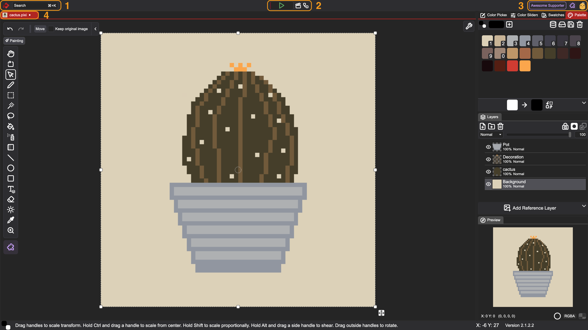

### 1. App Info + Search

On the left, there is a PixiEditor logo. Clicking on it shows the current version and lets you download an update if available -  you will see a blue dot on the logo if that's the case.
:::note
Direct updates are only available in the standalone version.
:::

For Windows and Linux users, there is an app menu between the logo and a search bar.

The last element here is a search bar. You can click on it or use a shortcut: ```Ctrl + K``` / ```⌘ + K```. 

It lets you search for files, but you can also look for actions like flipping, resizing, etc. It also shows a shortcut if available, so it is a good way to learn the app!

### 2. Quick Actions

-  <span className="pixi-icon icon-play" style="color: #5fad65;"/> - Mini animation player. You can play/pause your animation, but also manually move the red indicator (it marks a specific point in time within the animation).
-  <span className="pixi-icon icon-timeline"/> - Opens an Animation Timeline. Content of the Timeline depends on the active file.
-  <span className="pixi-icon icon-nodes"/> - Opens a Node Graph. Content of the Node Graph depends on the active file.

### 3. Account Info

On the right side, you can see an account icon. By logging in, you can access and purchase extensions. Some extensions include UI decorations like the "Awesome Supporter" badge.

Next to the account icon, there is an extension icon <span className="pixi-icon icon-extensions"/> that opens the Extension Library.

### 4. Opened Files

Right below the top bar, you can see a list of opened files. The active file is highlighted in red. There is always a small preview and a name. If a file has unsaved changes, you will see a white dot next to the name.

## Bottom Bar
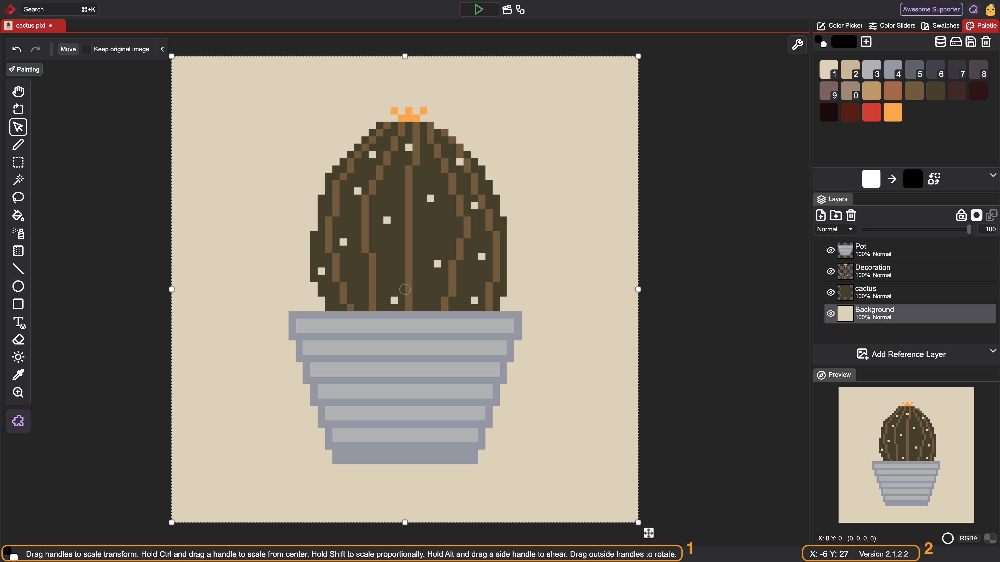

### 1. Color and Tool Info

- The two squares represent the current primary and secondary colors
- The text presents information about how to use the selected tool

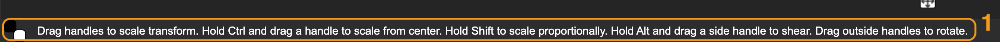

### 2. Position and Version Info

- The X and Y show your pointer position on the canvas. It is not limited to the size of the document.
- Next to it, there is the current version of the app.

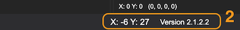

