This page explains how colors work in PixiEditor: how to choose a color, how to get back to colors you've used, how to keep sets of colors as palettes, and how to change colors in artwork you've already made.

## Basics

### Primary and Secondary Color

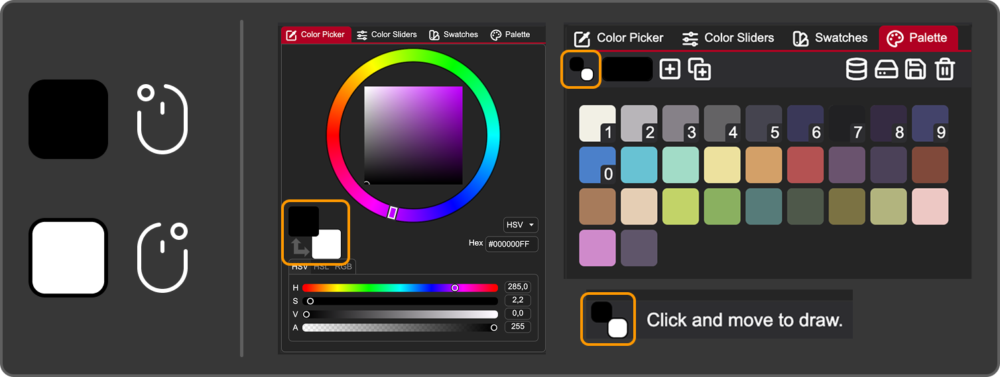

PixiEditor always has two active colors:
- The **primary color** is used with the **left mouse button**.
- The **secondary color** is used with the **right mouse button**.

This works with every tool that uses color. For example, with the pen tool, drag with the left mouse button to draw in the primary color and with the right mouse button to draw in the secondary color. You can set up two colors and switch between them without opening the color panel.

You can see both colors in the Color Picker tab, the Palette tab, and in the bottom bar. To swap them, press ```X```.

### RGBA

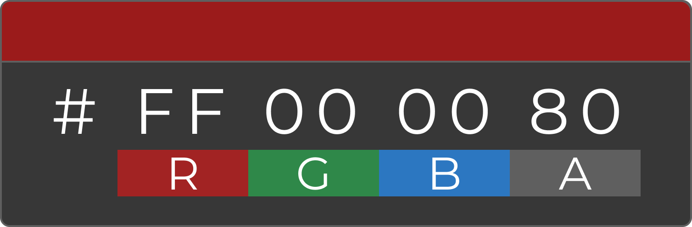

Colors in PixiEditor are RGBA: red, green, blue and alpha (transparency). In hex, this is written as ```#RRGGBBAA```, where every pair of characters is one channel. For example, ```#FF000080``` is red at 50% opacity.

## Choosing a Color

Let's look at the color panel, by default located in the top right corner of the interface. 

### Color Picker

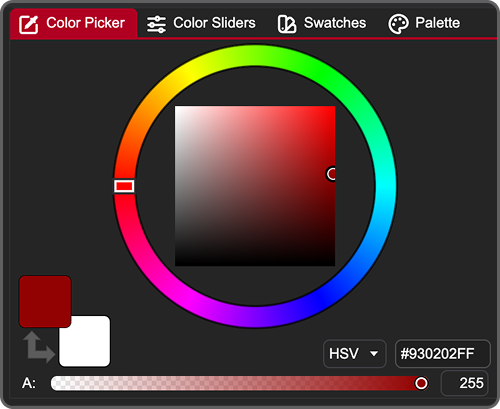

The main part of this tab is an HSV/HSL color picker made of a circular hue slider and a square for the other two values.

Elements in this tab are:

**Color square and hue ring:** Click or drag in the ring to choose the hue, and in the square to choose the other two values.

**Primary and secondary color:** The top square is the primary color and the one below is the secondary color. Clicking the arrow swaps the two (shortcut: ```X```).

**Alpha slider:** The wide slider at the bottom controls transparency. You can also type a value in the input on its right.

**HSV/HSL dropdown:** Switches the picker between HSV and HSL.

**Hex value:** Shows the current color in ```#RRGGBBAA``` format. You can use the input to type in a specific value.

### Color Slider

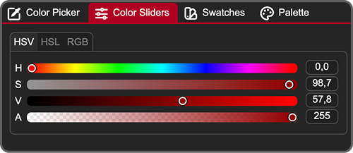

With these sliders, you change the primary color. It's a set of HSV, HSL and RGB sliders, plus alpha. Every slider has an input next to it for typing exact values.

| Channel | Range |
| ------- | ----- |
| Hue | 0 - 360 |
| Saturation, Value, Lightness | 0 - 100 |
| Red, Green, Blue, Alpha | 0 - 255 |

{/* some issues with this feature atm 

### Search Bar Color Input

You can also set a color without opening the color panel. 

Open the search bar with ```Ctrl + K``` / ```⌘ + K``` and type a color in hex or RGB format.

##### Pro tips
- Press ```Ctrl + R``` to quickly insert the rgb pattern.
- Just press ```Space``` in the rgb pattern after typing in a number to go to the next value.
- Press ```Ctrl + S``` to switch between rgb and hex. */}

### Picking a Color From the Canvas

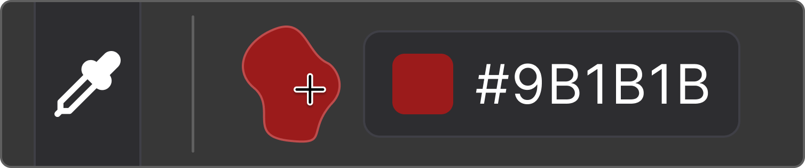

The color picker tool copies a color from your artwork into your primary color (left click) or secondary color (right click). You will find it in all default toolsets. Press ```o``` to access it faster.

In the tool's settings bar you can choose a scope: ```Single Layer``` or ```Canvas```. 

## Reusing Colors

### Color Swatches

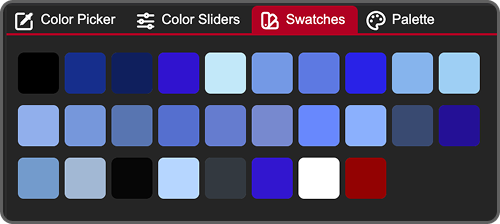

Using a canvas-editing tool (such as the pen, shapes, or bucket fill) automatically adds the color you used the swatches list.

Using non-editing tools like the color picker will not add a swatch.

Swatches are great for returning to a color you used a moment ago. To keep colors for longer or organize them, use a palette.

### Color Palette

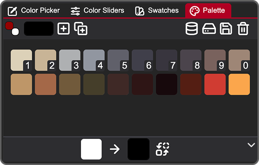

A palette is a set of colors that you choose and keep. Working with a limited palette keeps your artwork consistent. This tab lets you use and edit palettes.

#### Action Bar


- The two squares show current primary and secondary colors just like in the color picker
- The longer rectangle is for adding new colors to the color palette. It doesn't change the primary color. Clicking on it opens a small color picker.
-  <span className="pixi-icon icon-plus-square"/> - Adds selected color to the palette
-  <span className="pixi-icon icon-duplicate"/> - Adds swatches to the palette
-  <span className="pixi-icon icon-database"/> - Opens the Palette Browser 
-  <span className="pixi-icon icon-hard-drive"/> - Opens file manager to import a new palette from your drive.
-  <span className="pixi-icon icon-save"/> - Saves the palette to your drive
-  <span className="pixi-icon icon-trash"/> - Deletes the current palette

#### Colors

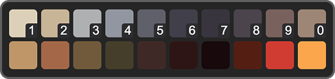

In the middle, you can see all colors of the palette.
- Click a color to set it as your primary color.
- Drag and drop colors to swap them.
- The first 10 colors have small numbers on them. These are shortcuts: press the corresponding number key (```1``` to ```0```) to set that color as your primary color.

:::tip
The number shortcuts follow the order of the palette, so put the colors you use most in the first 10 slots.
:::

#### Color Replacer


At the bottom of the tab, there is a panel for replacing colors. This is a global operation: it changes the color in your palette, and also **repaints every pixel on your canvas** that uses that color.

To replace a color:
1. Drag the color you want to change from your palette into the left rectangle.
2. Click the right rectangle to choose the replacement color.
3. Click the swap icon <span className="pixi-icon icon-swap"/> to apply the change.

#### Quick palette color picker

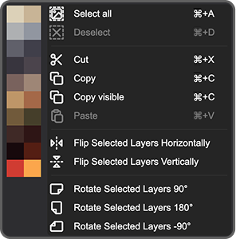

While using any tool that doesn't draw on the canvas (move, rotate, etc) you can right click anywhere on the canvas and a context menu will show. If you have an active palette, on the left side you will find a palette color list. Use it to quickly change your primary color.

## Palette Management

### Palette Browser

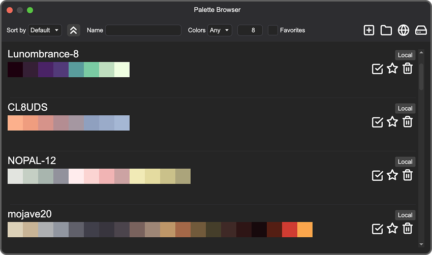

_Palettes on the screenshot imported from Lospec_

The Palette Browser is a library of every palette stored in PixiEditor, both the ones you created and the ones you downloaded. Open it with the browser button <span className="pixi-icon icon-database"/> in the Palette action bar.


At the top you can find following options:

-  Sorting by: ```Default``` / ```Alphabetical``` / ```Color Count```
-  <span className="pixi-icon icon-chevrons-down"/> / <span className="pixi-icon icon-chevrons-up"/> - Toggle to switch between ascending and descending order
-  Search bar to look up by name
-  Filtering by the number of colors in a palette. First you can choose an option from a dropdown ```Any``` / ```Max``` / ```Min``` / ```Exact``` and type in a number in the input on the right.
-  Option to see only your favorite palettes on the list.
-  <span className="pixi-icon icon-plus-square"/> - Adds your current palette to the browser
-  <span className="pixi-icon icon-folder"/> - Opens palette directory in your file manager
-  <span className="pixi-icon icon-globe"/> - Opens [Lospec](https://lospec.com/palette-list) palette list
-  <span className="pixi-icon icon-hard-drive"/> - Opens file manager to import a new palette from your drive

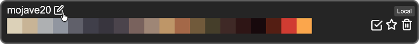

Actions you can take with each palette on the list:

-  Rename a palette by double clicking its name or hover over the name and click <span className="pixi-icon icon-edit"/>
-  <span className="pixi-icon icon-check"/> - Use palette for your current file
-  <span className="pixi-icon icon-star"/> - Add palette to favorites (it will go to the top of the list)
-  <span className="pixi-icon icon-trash"/> - Delete a palette

### Getting Palettes

{/* going to be added soon, then docs will be updated

#### Token Beam */}

#### Lospec 

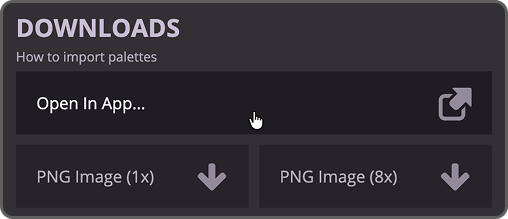

[Lospec](https://lospec.com/palette-list) is a popular pixel art platform with a large palette database. You can import a palette with one click using the ```Open In App...``` button on the site.

#### From a file

Click the import icon <span className="pixi-icon icon-hard-drive"/> in the action bar and choose a palette file from your drive.

:::tip
You can import a PNG image, and its colors will be turned into a new palette. Works best with pixel art.
:::

#### Manually 
You can also copy palette files into PixiEditor's palettes folder. To open the folder click this icon <span className="pixi-icon icon-folder"/> in the action bar in the browser.

Or use a direct path:

- Windows ```C:/Users/<your user name>/AppData/Roaming/PixiEditor/Palettes```
- Linux ```/home/<your user name>/.local/share/PixiEditor/Palettes```
- macOS ```/Users/<your user name>/Library/Application Support/PixiEditor/Palettes```

#### Supported Color Palette Formats

| Name                              | Open | Save |
| --------------------------------- | ---- | ---- |
| Cls                               | yes  | yes  |
| Jasc Palette    .pal, .psppalette | yes  | yes  |
| CorelDraw .pal                    | yes  | yes  |
| DeluxePaint   .bbm, .lbm          | yes  | no   |
| Gimp GPL .pal                     | yes  | yes  |
| Hex                               | yes  | yes  |
| Paint.NET Palette .txt            | yes  | yes  |
| Pixi                              | yes  | no   |
| Png                               | yes  | yes  |

### Saving a Palette

The active palette is saved within the ```.pixi``` file, but if you want to reuse it across files, you can:

1. Save it to your drive by clicking <span className="pixi-icon icon-save"/>. Check what formats are supported in the table above.
2. Go to Palette Browser and add your current palette to the browser by clicking <span className="pixi-icon icon-plus-square"/>. It automatically creates a ```.pal``` file in the ```PixiEditor/Palettes``` folder.


## Changing Colors on Canvas

Besides the [Color Replacer](#color-replacer), you have a few more options:
- The **Adjustments** toolset has tools for color, exposure and image corrections.
- If you work with the [Node Graph](/docs/handbook/node-graph/getting-started-with-node-graph/), there are color-related nodes such as [Palette](/docs/handbook/node-graph/nodes/color/palette/), [Decompose Palette](/docs/handbook/node-graph/nodes/color/decompose-palette/), [Color Map](/docs/handbook/node-graph/nodes/image/color-map/), [Color Ramp](/docs/handbook/node-graph/nodes/image/color-ramp/) and [Posterize](/docs/handbook/node-graph/nodes/effects/posterize/).