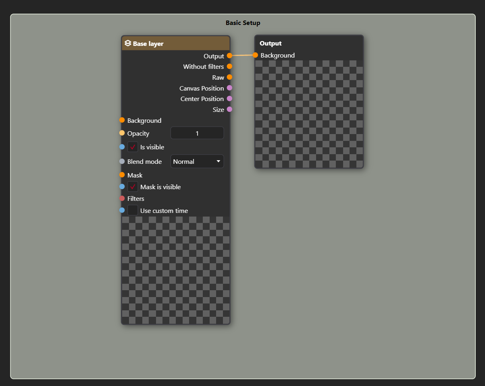

---
title: Comment
node:
  name: Comment
  category: Annotation
  icon: icon-message
  isPair: false
  hasPreview: false
  description: 'A comment zone which can be stretched over multiple nodes to provide additional information or context. It is a visual aid for organizing and annotating the node graph. It can be recolored.'
---

