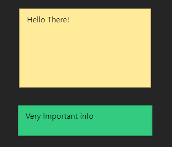

---
title: Sticky Note
node:
  name: Sticky Note
  category: Annotation
  icon: icon-file-text
  isPair: false
  hasPreview: false
  description: 'A sticky note that can be placed in the node graph to provide additional information or context. It is a visual aid for organizing and annotating the node graph. It can be recolored.'
---

