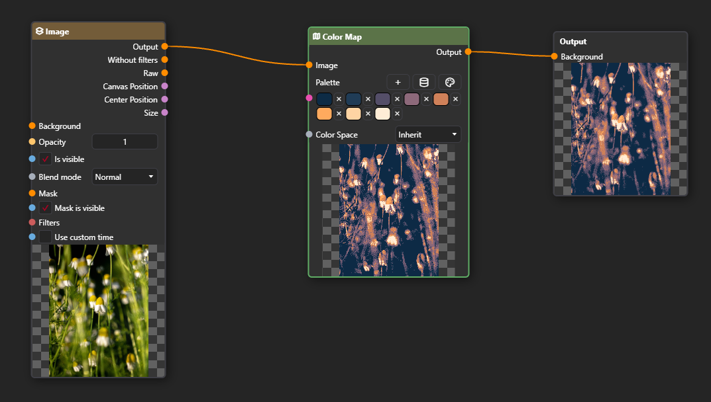

---
title: Color Map
node:
  name: Color Map
  category: Image
  icon: icon-map
  isPair: false
  hasPreview: true
  inputs:
  - name: Palette
    type: Palette
    description: 'Palette object that defines the color mapping. The colors in the input image will be mapped to the corresponding colors in this palette.'
  - name: Color Space
    type: ColorSpaceType
    description: 'Specifies the color space in which the color mapping should be performed. This affects how colors are interpreted and mapped from the input image to the palette.'
    typeLink: '#color-space-type'
  outputs:
  - name: Output
    type: Painter
    description: 'The color-mapped output.'
    isContextful: false
    default: 'null'
  description: 'The Color Map node remaps the colors of an input image based on a specified palette. It takes a Palette object as input and maps the colors in the input image to the corresponding colors in the palette, allowing for color transformations and stylization effects.'
---

## Color Space Type

### Inherit

Color Space of the document will be used.

### Srgb

Forces the color mapping to be performed in the sRGB color space.

### Linear Srgb

Forces the color mapping to be performed in the linear sRGB color space.
