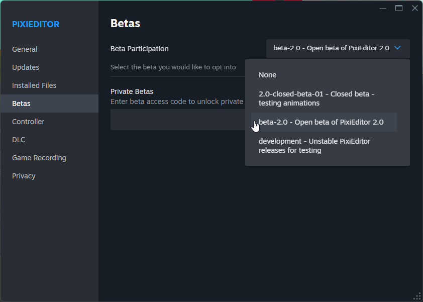

First of all, thank you for your interest in testing latest PixiEditor features!

:::caution
    Development channel may be less stable and more prone to bugs, use with caution.
:::

:::note
    We strongly recommend joining [PixiEditor Forum](https://forum.pixieditor.net) and [Discord](https://discord.gg/qSRMYmq) to report bugs, share feedback, and discuss the Open Beta with other testers.
:::

There are 2 ways to select the Development Channel:

## Steam

1. Go to the [PixiEditor 2.0 Steam page](https://store.steampowered.com/app/2218560/PixiEditor__Pixel_Art_Editor/) and add the app to your library with "Free" button.
2. Install the app from your library.
3. Right click on the app in your library and select "Properties".

4. Go to the "Betas" tab and select `development` from the dropdown menu.

5. Wait for the app to update and enjoy the latest features.

## Standalone Development Channel

Download Linux build [here](https://github.com/PixiEditor/PixiEditor-development-channel/releases/latest)

1. Run PixiEditor (Make sure it's not from Steam or Microsoft Store, it must be downloaded from [pixieditor.net](https://pixieditor.net).
2. Open File -> Settings -> Updates.
3. Choose "Development" from the "Update stream" dropdown menu.

