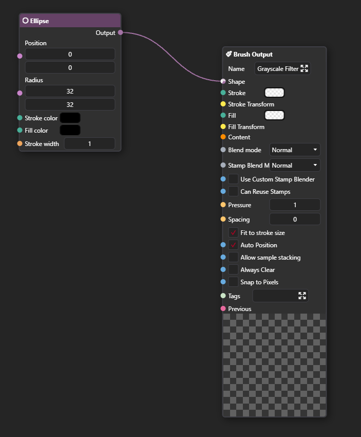
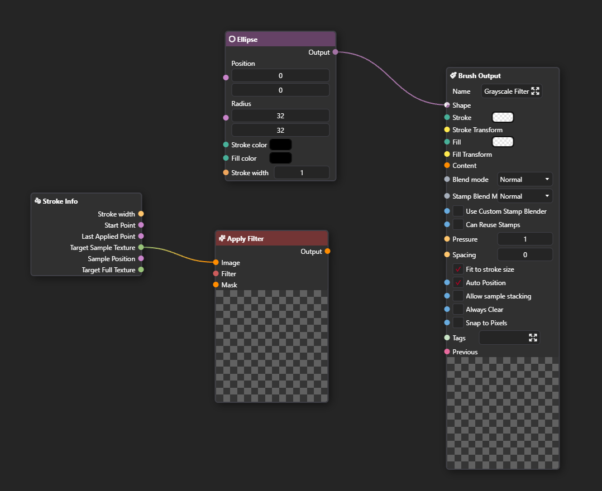
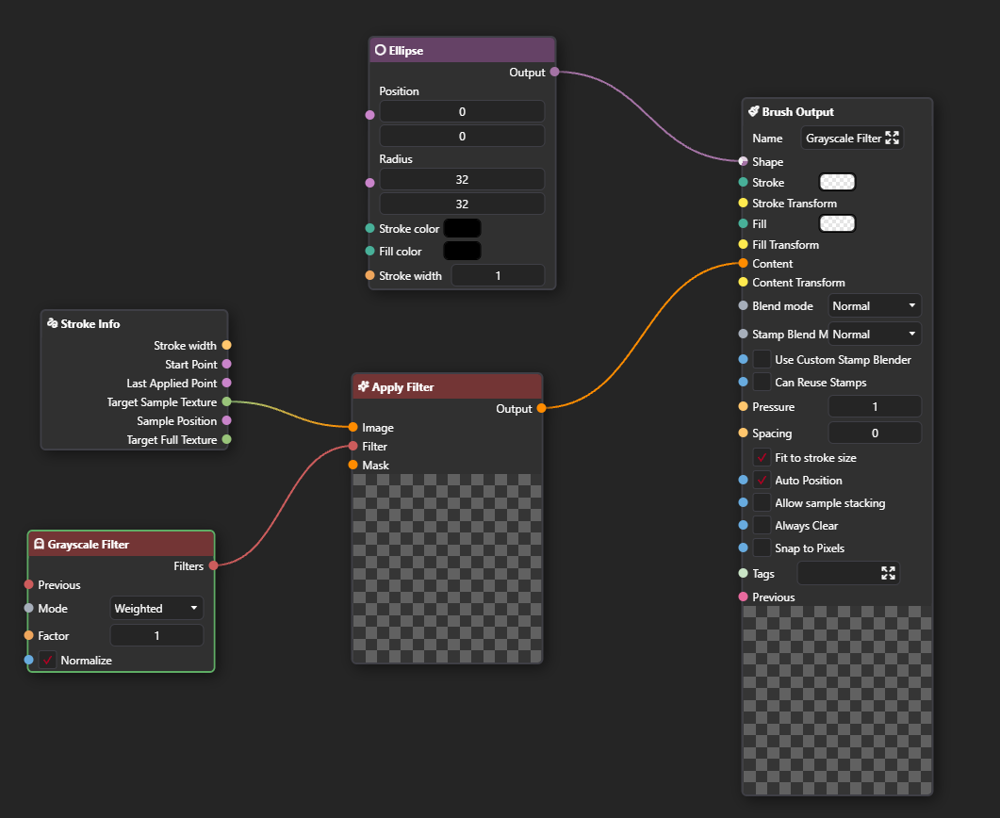
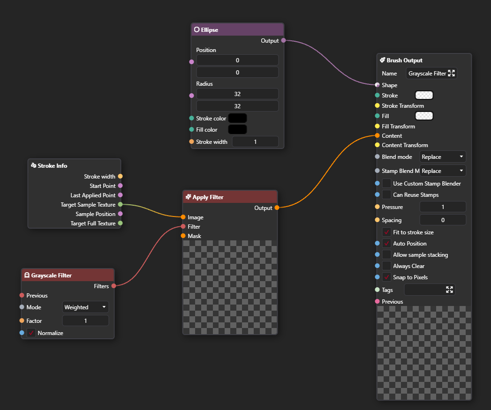
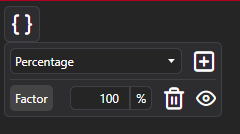
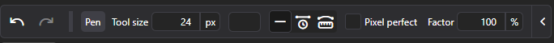

import { Aside, Steps } from '@astrojs/starlight/components';
import { List } from "starlight-videos/components";

<Aside variant="tip" title="Before you start">
  If you haven't already, check out the [Creating custom brushes - Basic](/docs/usage/brushes/creating-brushes) guide first. It covers the basics of creating custom brushes and will help you understand the concepts used in this guide.
</Aside>

Now, we've created a simple brush that responds to the pressure of the pen and (hopefully) to the primary color of PixiEditor. Let's explore some more advanced techniques that you can use to create even more complex and interesting brushes.

<List title='Prerequisites'>
- [ ] A basic understanding of the [Node Graph](/docs/usage/node-graph/getting-started-with-node-graph)
- [ ] Basic knowledge of [creating custom brushes](/docs/usage/brushes/creating-brushes)
</List>

## Glossary

Before we dive into the advanced techniques, let's quickly go through some of the terms that we will be using in this guide:

- `Stamp` - a single application of the brush on the canvas. When you draw with a brush, it is applying multiple stamps along the stroke.
- `Sampling` - the process of reading pixels from the texture.

## Sampling and modifying the canvas

One of the most powerful features of the Brush Engine is the ability to sample the canvas and use that information to modify the stamps. This allows you to create brushes that react to the content of the canvas.

You can access any layer and any texture you want, but we'll focus on the most common use case, which is sampling the layer that the brush is currently applied to.

We'll use [Stroke Info](/docs/usage/node-graph/nodes/brushes/stroke-info/) node for that. 

### Creating a grayscale filter brush

<Steps>

1. Let's start with basic brush with an Ellipse shape, like the one we created in the basic guide,
    
2. Now, create a [Stroke Info](/docs/usage/node-graph/nodes/brushes/stroke-info/) node and [Apply Mask](/docs/usage/node-graph/nodes/filters/apply-mask/) node. Connect the [Target Sample Texture](/docs/usage/node-graph/nodes/brushes/stroke-info/#target-sample-texture) output of the Stroke Info node to the Image input of the Apply Mask node,
    
    
    Target Sample Texture is a texture with size of the brush stroke bounding box, which contains the pixels from the layer that the brush is applied to, sampled at the position of each stamp.

    We'll use it with the combination of Apply Mask node to modify the sampled stamp with a grayscale filter.
3. Create a [Grayscale Filter](/docs/usage/node-graph/nodes/filters/grayscale-filter/) node and connect Filters output to the Filter input of the Apply Mask node. Finally, connect the output of the Apply Mask node to the Content input in Brush Output node.
    
4. Toggle `Snap to Pixels` in the Brush Output node. If we didn't do that, applying the brush would displace or blur semi-transparent pixels. This is due to the fact, that sampling the canvas is done at the precise pointer coordinates, which can be in between pixels.
5. Set Blend Mode and Stamp Blend Mode in the Brush Output node to Replace. This will make the brush replaces the pixels on the canvas with the modified pixels from the Apply Mask node, instead of blending them together. Here's how the final node setup should look like:
    
</Steps>

Now, when you draw with this brush, it will sample the pixels from the canvas, apply a grayscale filter to them and then apply the modified pixels back to the canvas. This creates a brush that turns the area it is applied to into grayscale.

## Blackboard

Check out the [Blackboard](/docs/usage/node-graph/blackboard/) documentation to learn more about the blackboard.

In context of brushes, blackboard serves a special purpose of exposing properties in the toolbar when the brush is selected. This allows you to create brushes with customizable properties that can be easily accessed and modified by the user without having to open the Node Graph. 

Now, when you select a brush in the Pen Tool with exposed blackboard properties, you'll see those properties in the toolbar.

Note that not all property types have a dedicated toolbar editor.