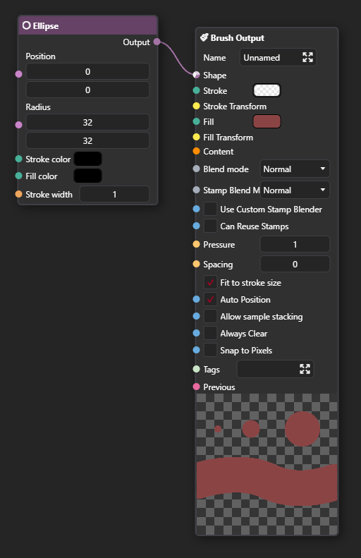
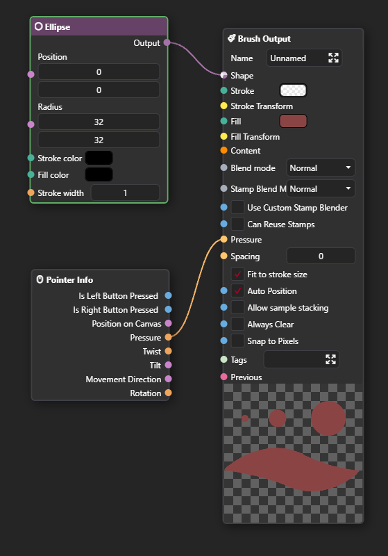

import { Steps } from '@astrojs/starlight/components';
import { List } from "starlight-videos/components";

<List title='Prerequisites'>
- [ ] A basic understanding of the [Node Graph](/docs/usage/node-graph/getting-started-with-node-graph)
- [ ] A knowledge on [how to use brushes](/docs/usage/brushes/getting-started)
</List>

## Core concepts

1. PixiEditor uses Node Graph for it's Brush Engine, which allows users to create custom brushes by connecting various nodes together,
2. A single brush is defined with [Brush Output](/docs/usage/node-graph/nodes/brushes/brush-output/) node,
3. Each Brush needs a Vector Shape. It defines an area where the brush is applied,

## Your first brush

<Steps>

1. Create a new file,
2. Open the Node Graph panel, 
3. Create a [Brush Output](/docs/usage/node-graph/nodes/brushes/brush-output/) node,
4. Create a [Ellipse](/docs/usage/node-graph/nodes/shapes/ellipse/) node and connect its output to the [Shape](/docs/usage/node-graph/nodes/brushes/brush-output/#shape) input of the [Brush Output](/docs/usage/node-graph/nodes/brushes/brush-output/) node,
5. Click on the [Fill](/docs/usage/node-graph/nodes/brushes/brush-output/#shape) color input of the [Brush Output](/docs/usage/node-graph/nodes/brushes/brush-output/) node and set it to a color of your choice. This is how it should look like:
  
6. Come back to the viewport, select the Pen tool and click on the brush selector, your newly created brush should be there.

</Steps>

There are a lot of options in the Brush Output node, here's a short explanation of what's happening in the above example:

- We've created a brush with "Unnamed" name - this value is used in the brush selector,
- The shape of the brush is defined by the Ellipse node, which creates an elliptical shape. Even though the shape is 32x32 pixels, the brush will be resized to fit the size of the stroke, because `Fit to stroke size` option is enabled,
- Even though the position of the shape is set to (0, 0) in Ellipse Node, the brush will be centered on the cursor, because `Auto Position` option is enabled,
- The color of the brush is always red and not responsive to PixiEditor's primary color, because the Fill is set to a constant color value.
- This brush will not be affected by the pressure of the pen, because the Pressure is hardcoded to 1.
- Spacing is set to 0, which means that the brush will be stamped continuously without any gaps between the stamps.

Check out the [Brush Output](/docs/usage/node-graph/nodes/brushes/brush-output/) node documentation for more information about all the options available in the Brush Output node.

## Make it respond to the pressure of the pen

Now, let's make the brush respond to the pressure of the pen. It is a very straightforward process, we just need to connect the Pressure output of the Pointer Info node to the Pressure input of the Brush Output node. Here's how to do it:

<Steps>

1. Create a [Pointer Info](/docs/usage/node-graph/nodes/inputs/pointer-info/) node,
2. Connect the Pressure output of the Pointer Info node to the Pressure input of the Brush Output node.
  

</Steps>

Now, following the same logic, try to make this Brush respond to the primary color of PixiEditor. Hint: you need to use a different node for that, not Pointer Info.

## Getting familiar

The best way to get familiar with creating custom brushes is to experiment! A very good way to start is to duplicate existing brushes and modify them to see how they work. You can also check out the [Brush Output](/docs/usage/node-graph/nodes/brushes/brush-output/) node documentation to learn about all the options available.

If you are feeling comfortable with creating simple brushes, you can check out the [Creating custom brushes - Advanced](/docs/usage/brushes/advanced-brush) guide, where we will dive deeper into the Brush Engine and its capabilities.

## Brush Preview

By default, PixiEditor will generate a stamp preview for your brush automatically. However, if your document has anything connected to the [Output Node](/docs/usage/node-graph/nodes/misc/output), the automatic stamp preview will be disabled and the contents of the Output Node will be used instead.