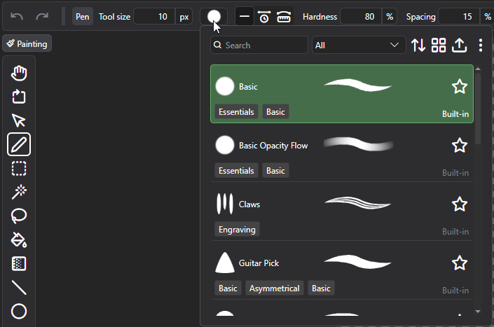
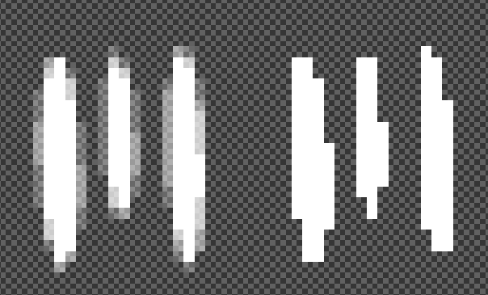

PixiEditor has a powerful brush system powered by the Node Graph. This guide will help you get started with using, creating and customizing brushes in PixiEditor.

## Accessing Brushes

Brushes can be accessed from the tools that support them. The most basic ones are Pen and Eraser.

Open the brush picker to see the available brushes. Click on a brush to select it or hover over it to see a preview of the brush stroke.

Brush Picker categorizes brushes by using tags. Each Brush can have it's own tags, which you can remove or add your own. You can filter brushes by tags or search for them by name.

## Editing and duplicating existing brushes

Most brushes are editable or can be duplicated and then edited. Right click on the brush to open the context menu. Here you can find options to edit or duplicate the brush.

In the bottom right corner of the brush, you'll see the source of the brush. Here are the meanings of each source:

- `Built-in` - the brush is built into PixiEditor. It can't be directly edited, but can be duplicated and then edited.
- `Local` - the brush is stored on your computer in the brushes folder. It can be edited directly and duplicated.
- `Opened Document` - the brush is defined in one of currently opened documents. It can't be edited by clicking "Edit". You can edit it by going to the document it's defined in. It can be duplicated and then edited.
- `{Name of the extension}` - the brush is provided by an extension. It can't be edited and may or may not be duplicated, depending on the extension's settings.

Duplicating a brush will create a `Local` copy of it. Click on the  icon in the top right corner of the brush picker to see more options, including "Open brushes folder". 
This will open the folder where all `Local` brushes are stored.

## Behavior of brushes in pixel art and painting toolsets

There is a difference in how brushes behave between pixel art and painting toolsets. This applies to Pen and Eraser tools, other brush-based tools might have their own specific behavior.

In pixel art toolset, brushes will be usually applied **without anti-aliasing**. Some brushes may create their own anti-aliasing, which will be always the same regardless of the toolset.

In painting toolset, brushes will be applied **with anti-aliasing**.

Compare the following images, which show the same brush applied in pixel art and painting toolsets:

On the left - painting toolset, on the right - pixel art toolset.
