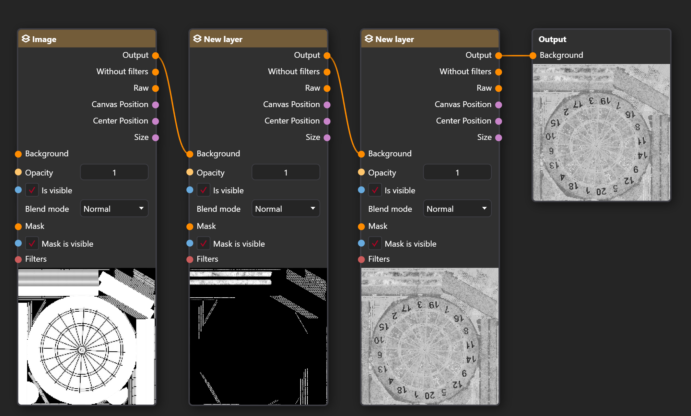
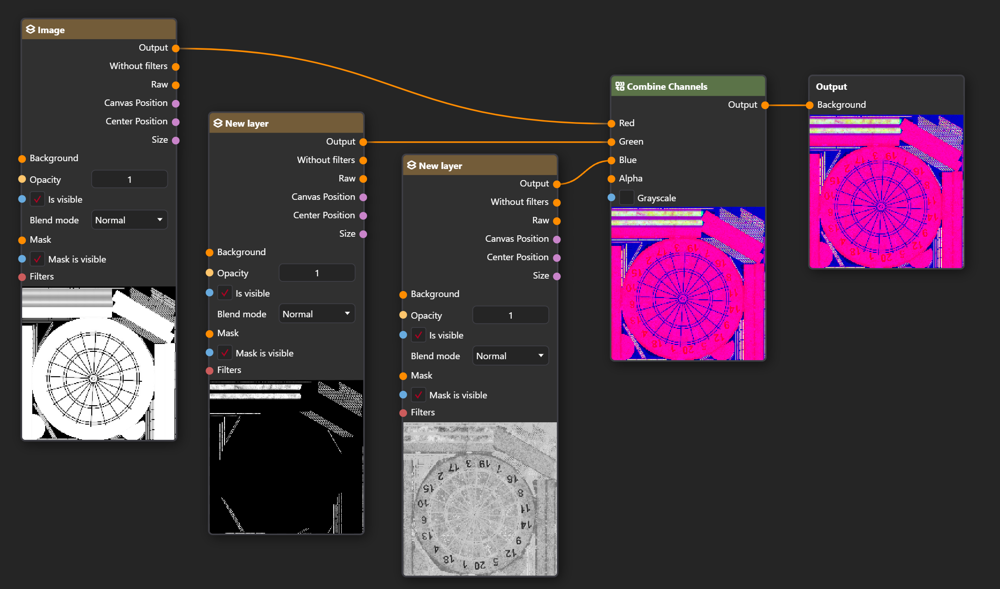
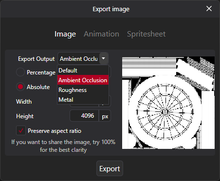

import { Image, Picture } from 'astro:assets';
import ExampleAmbientOcclusion from './assets/dartboard_ao_4k.png';
import ExampleMetal from './assets/dartboard_metal_4k.png';
import ExampleRough from './assets/dartboard_rough_4k.png';
import ExamplePacked from './assets/dartboard_ao_metal_rough_packed.png';
import UnpackedGraph from './assets/unpackingFinalGraph.png';

Channel packing is the process of combining multiple single-channel images into a single RGB image, often used in game development to improve performance.

As an example, these three maps representing Ambient Occlusion, Metal, and Roughness from this [Dartboard model](https://polyhaven.com/a/dartboard) on PolyHaven can be combined into a single asset.

    <Image class="w-full h-auto" src={ExampleAmbientOcclusion} width="1028" widths={[1028, 512]} alt="Ambient Occlusion Map" />
    
    <Image class="w-full h-auto" src={ExampleMetal} width="1028" widths={[512]} alt="Metal Map" />
    
    <Image class="w-full h-auto" src={ExampleRough} width="1028" widths={[512]} alt="Roughness Map" />

Packing these three, where Ambient Occlusion = Red, Metal = Green, and Roughness = Blue will result in this:

<Image class="max-w-xs" src={ExamplePacked} width="1028" widths={[512]} alt="Packed Map" />

### Limitations of packing

You can only pack images that can be represented
by a single color channel (the source must be grayscale or have meaningful data in only one channel).

## Packing using Nodes

Packing can be done very quickly using Nodes in PixiEditor.

1. Open one of your maps in PixiEditor.

:::caution
Saving will write directly to the original map file.   To avoid accidentally overwriting it, first save the image as a .pixi file using `File -> Save as`.
:::

2. Paste your other maps into the opened document and keep them on separate layers.
1. Open the Node Graph by clicking the  button at the top center
of the window or by going to `View -> Open Tab -> Graph View`.  
You should see a Node Graph like this:

3. For each Layer node, disconnect the Background input so the layers are not put together.
1. Open the Node Picker (right-click or press Space) and add a [ **Combine Channels**](../../nodes/image/combine-channels) node.
1. Connect the Combine Channels node to the Output node.
1. Connect each layer to its respective channel on the Combine Channels node.  
Your graph should end up looking like this:

That's it. You can now export your packed map using `File -> Export` and use it wherever you need.

## Unpacking using Nodes

You can also unpack a packed map using Nodes.

1. Open your packed map in PixiEditor.

:::caution
Saving will write directly to the original map file.   To avoid accidentally overwriting it, first save the image as a .pixi file using `File -> Save as`.
:::

2. Open the Node Graph by clicking the  button at the top center
of the window or by going to `View -> Open Tab -> Graph View`.
1. Open the Node Picker (right-click or press Space) and add a [ **Separate Channels**](../../nodes/image/separate-channels) node, and enable the **Grayscale** option (otherwise, each map will be tinted red, green, or blue).
1. Connect the Layers output to the Image input of the Separate Channels node.
1. Create a [ **Custom Output**](../../nodes/workspace/custom-output) node for each channel you want to extract.
1. Name each output accordingly.  
Your graph should end up looking like this:

<Image class="min-md:max-w-2/3" src={UnpackedGraph} alt="Unpacked Graph" />

You can now export each map using `File -> Export`, then select the map you want to export.

## Resources

All maps used in this tutorial are from the Dartboard model https://polyhaven.com/a/dartboard on PolyHaven

Files: 
<a href="/docs/resources/DartboardPacked.pixi">DartboardPacked.pixi</a>
and
<a href="/docs/resources/DartboardUnpacked.pixi">DartboardUnpacked.pixi</a>