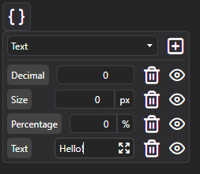
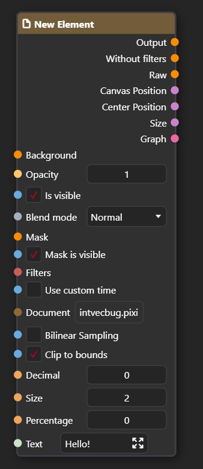

Blackboard is a system for defining variables, constants and graph inputs. It can be found in the top left corner of the Node Graph panel. Under the  icon, you can find options to add variables and graph inputs.

Select desired variable type from the menu and click on  icon to add it to the blackboard. It can now be accessed in the graph.

## Accessing variables

Variables defined in the blackboard can be accessed by using the [Blackboard Variable Value](/docs/usage/node-graph/nodes/misc/blackboard-variable-value) node.

## Nested documents and blackboard

When using [Nested Document](/docs/usage/node-graph/nodes/structure/nested-document) nodes (smart layers), PixiEditor will automatically create inputs from the document's blackboard as part of the nested document node.

Each variable has an option not to be exposed as a graph input by toggling off the  icon next to the variable in the blackboard.

For more information about smart layers and nested documents, check out the [Nested Document](/docs/usage/node-graph/nodes/structure/nested-document) and [Expose Values](/docs/usage/node-graph/nodes/workspace/expose-value) documentation.

## Brushes and blackboard

Blackboard serves a special role when creating brushes, check [Creating custom brushes - Advanced](/docs/usage/brushes/advanced-brush#blackboard) guide for more details.

## Available variable types

For the details about each variable type, see the [Property Sockets](/docs/usage/node-graph/property-sockets) page.

### Decimal Number

Decimal Number is a variable type that represents a double (floating point number with 64 bits of precision), such as 0.5, -1.23, etc.

Node Editor Available: `Yes`  
Toolbar Editor Available: `Yes`

### Size

Size is a variation of Decimal Number, it represents a positive whole number, such as 0, 1, 2, etc.

Node Editor Available: `Yes`  
Toolbar Editor Available: `Yes`

### Whole Number

Whole Number is a variable type that represents a whole number, such as -1, 0, 1, 2, etc.

Node Editor Available: `Yes`  
Toolbar Editor Available: `Yes`

### Vector

Vector is a variable type that represents a 2D vector, which has two components: X and Y. Each component is a Decimal Number.

Node Editor Available: `Yes`  
Toolbar Editor Available: `No`

### Whole Number Vector

Whole Number Vector is a variable type that represents a 2D vector, which has two components: X and Y. Each component is a Whole Number.

Node Editor Available: `Yes`  
Toolbar Editor Available: `No`

### Text

Text is a variable type that represents a string of characters, such as "Hello, World!".

Node Editor Available: `Yes`  
Toolbar Editor Available: `Yes`

### Font Family

Font Family is a variable type that represents a font family, such as "Arial", "Times New Roman", etc.

Node Editor Available: `Yes`  
Toolbar Editor Available: `Yes`

### Matrix

Matrix is a variable type that represents a 3x3 matrix, which is used for transformations in 2D space.

Node Editor Available: `No`  
Toolbar Editor Available: `No`

### Boolean (true/false)

Boolean is a variable type that represents a value that can be either true or false.

Node Editor Available: `Yes`  
Toolbar Editor Available: `Yes`

### Brush

Brush is a variable type that represents a reference to the document of the brush.

Node Editor Available: `No`  
Toolbar Editor Available: `Yes`

### Document

Document is a variable type that represents a reference to any pixi document. Selecting a document from within the blackboard editor will load the document, but not link it (updating the source document won't update the variable value automatically).

Node Editor Available: `Yes`  
Toolbar Editor Available: `Yes`

### Paintable

Paintable is a type that describes fill/brush. Color is a paintable, it describes a solid color fill. Another type of paintable is a Gradient, which describes a gradient fill and Texture Paintable, which describes a texture fill.

Node Editor Available: `Yes`  
Toolbar Editor Available: `Yes`

### Color

Color is a variable type that represents a RGBA color.

### Texture

Texture is a variable type that represents a reference to a texture.

Node Editor Available: `Yes`  
Toolbar Editor Available: `Yes`

### Painter

Painter is a variable type that represents a set of instructions for painting on a canvas.

Node Editor Available: `No`  
Toolbar Editor Available: `No`

### Vector Path

Vector Path is a variable type that represents a path made out of vector points.

Node Editor Available: `No`  
Toolbar Editor Available: `No`

### Any

Any is a variable type that can hold any value of any type.

Node Editor Available: `No`  
Toolbar Editor Available: `No`